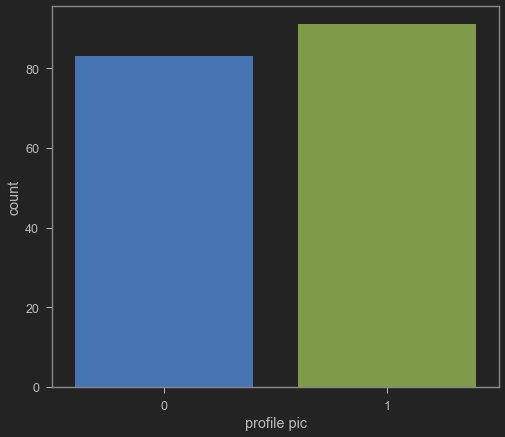

# TASK #1: IMPORT DATASETS AND LIBRARIES


```python
# !pip install tensorflow==2.0
```


```python
import pandas as pd
import matplotlib.pyplot as plt
import numpy as np
import seaborn as sns

import tensorflow as tf
from tensorflow import keras
from tensorflow.keras.layers import Dense, Activation, Dropout
from tensorflow.keras.optimizers import Adam
from tensorflow.keras.metrics import Accuracy

from sklearn import metrics
from sklearn.preprocessing import LabelEncoder
from sklearn.metrics import classification_report,accuracy_score,roc_curve,confusion_matrix

```


```python
from jupyterthemes import jtplot
jtplot.style(theme='monokai', context='notebook', ticks=True, grid=False) 
# setting the style of the notebook to be monokai theme  
# this line of code is important to ensure that we are able to see the x and y axes clearly
# If you don't run this code line, you will notice that the xlabel and ylabel on any plot is black on black and it will be hard to see them. 
```


```python
# Load the training dataset
instagram_df_train = pd.read_csv('insta_train.csv')
instagram_df_train
```


<div>
<style scoped>
    .dataframe tbody tr th:only-of-type {
        vertical-align: middle;
    }

    .dataframe tbody tr th {
        vertical-align: top;
    }

    .dataframe thead th {
        text-align: right;
    }
</style>
<table border="1" class="dataframe">
  <thead>
    <tr style="text-align: right;">
      <th></th>
      <th>profile pic</th>
      <th>nums/length username</th>
      <th>fullname words</th>
      <th>nums/length fullname</th>
      <th>name==username</th>
      <th>description length</th>
      <th>external URL</th>
      <th>private</th>
      <th>#posts</th>
      <th>#followers</th>
      <th>#follows</th>
      <th>fake</th>
    </tr>
  </thead>
  <tbody>
    <tr>
      <th>0</th>
      <td>1</td>
      <td>0.27</td>
      <td>0</td>
      <td>0.00</td>
      <td>0</td>
      <td>53</td>
      <td>0</td>
      <td>0</td>
      <td>32</td>
      <td>1000</td>
      <td>955</td>
      <td>0</td>
    </tr>
    <tr>
      <th>1</th>
      <td>1</td>
      <td>0.00</td>
      <td>2</td>
      <td>0.00</td>
      <td>0</td>
      <td>44</td>
      <td>0</td>
      <td>0</td>
      <td>286</td>
      <td>2740</td>
      <td>533</td>
      <td>0</td>
    </tr>
    <tr>
      <th>2</th>
      <td>1</td>
      <td>0.10</td>
      <td>2</td>
      <td>0.00</td>
      <td>0</td>
      <td>0</td>
      <td>0</td>
      <td>1</td>
      <td>13</td>
      <td>159</td>
      <td>98</td>
      <td>0</td>
    </tr>
    <tr>
      <th>3</th>
      <td>1</td>
      <td>0.00</td>
      <td>1</td>
      <td>0.00</td>
      <td>0</td>
      <td>82</td>
      <td>0</td>
      <td>0</td>
      <td>679</td>
      <td>414</td>
      <td>651</td>
      <td>0</td>
    </tr>
    <tr>
      <th>4</th>
      <td>1</td>
      <td>0.00</td>
      <td>2</td>
      <td>0.00</td>
      <td>0</td>
      <td>0</td>
      <td>0</td>
      <td>1</td>
      <td>6</td>
      <td>151</td>
      <td>126</td>
      <td>0</td>
    </tr>
    <tr>
      <th>...</th>
      <td>...</td>
      <td>...</td>
      <td>...</td>
      <td>...</td>
      <td>...</td>
      <td>...</td>
      <td>...</td>
      <td>...</td>
      <td>...</td>
      <td>...</td>
      <td>...</td>
      <td>...</td>
    </tr>
    <tr>
      <th>571</th>
      <td>1</td>
      <td>0.55</td>
      <td>1</td>
      <td>0.44</td>
      <td>0</td>
      <td>0</td>
      <td>0</td>
      <td>0</td>
      <td>33</td>
      <td>166</td>
      <td>596</td>
      <td>1</td>
    </tr>
    <tr>
      <th>572</th>
      <td>1</td>
      <td>0.38</td>
      <td>1</td>
      <td>0.33</td>
      <td>0</td>
      <td>21</td>
      <td>0</td>
      <td>0</td>
      <td>44</td>
      <td>66</td>
      <td>75</td>
      <td>1</td>
    </tr>
    <tr>
      <th>573</th>
      <td>1</td>
      <td>0.57</td>
      <td>2</td>
      <td>0.00</td>
      <td>0</td>
      <td>0</td>
      <td>0</td>
      <td>0</td>
      <td>4</td>
      <td>96</td>
      <td>339</td>
      <td>1</td>
    </tr>
    <tr>
      <th>574</th>
      <td>1</td>
      <td>0.57</td>
      <td>1</td>
      <td>0.00</td>
      <td>0</td>
      <td>11</td>
      <td>0</td>
      <td>0</td>
      <td>0</td>
      <td>57</td>
      <td>73</td>
      <td>1</td>
    </tr>
    <tr>
      <th>575</th>
      <td>1</td>
      <td>0.27</td>
      <td>1</td>
      <td>0.00</td>
      <td>0</td>
      <td>0</td>
      <td>0</td>
      <td>0</td>
      <td>2</td>
      <td>150</td>
      <td>487</td>
      <td>1</td>
    </tr>
  </tbody>
</table>
<p>576 rows × 12 columns</p>
</div>


```python
# Load the testing data
instagram_df_test = pd.read_csv('insta_test.csv')
instagram_df_test
```


<div>
<style scoped>
    .dataframe tbody tr th:only-of-type {
        vertical-align: middle;
    }

    .dataframe tbody tr th {
        vertical-align: top;
    }

    .dataframe thead th {
        text-align: right;
    }
</style>
<table border="1" class="dataframe">
  <thead>
    <tr style="text-align: right;">
      <th></th>
      <th>profile pic</th>
      <th>nums/length username</th>
      <th>fullname words</th>
      <th>nums/length fullname</th>
      <th>name==username</th>
      <th>description length</th>
      <th>external URL</th>
      <th>private</th>
      <th>#posts</th>
      <th>#followers</th>
      <th>#follows</th>
      <th>fake</th>
    </tr>
  </thead>
  <tbody>
    <tr>
      <th>0</th>
      <td>1</td>
      <td>0.33</td>
      <td>1</td>
      <td>0.33</td>
      <td>1</td>
      <td>30</td>
      <td>0</td>
      <td>1</td>
      <td>35</td>
      <td>488</td>
      <td>604</td>
      <td>0</td>
    </tr>
    <tr>
      <th>1</th>
      <td>1</td>
      <td>0.00</td>
      <td>5</td>
      <td>0.00</td>
      <td>0</td>
      <td>64</td>
      <td>0</td>
      <td>1</td>
      <td>3</td>
      <td>35</td>
      <td>6</td>
      <td>0</td>
    </tr>
    <tr>
      <th>2</th>
      <td>1</td>
      <td>0.00</td>
      <td>2</td>
      <td>0.00</td>
      <td>0</td>
      <td>82</td>
      <td>0</td>
      <td>1</td>
      <td>319</td>
      <td>328</td>
      <td>668</td>
      <td>0</td>
    </tr>
    <tr>
      <th>3</th>
      <td>1</td>
      <td>0.00</td>
      <td>1</td>
      <td>0.00</td>
      <td>0</td>
      <td>143</td>
      <td>0</td>
      <td>1</td>
      <td>273</td>
      <td>14890</td>
      <td>7369</td>
      <td>0</td>
    </tr>
    <tr>
      <th>4</th>
      <td>1</td>
      <td>0.50</td>
      <td>1</td>
      <td>0.00</td>
      <td>0</td>
      <td>76</td>
      <td>0</td>
      <td>1</td>
      <td>6</td>
      <td>225</td>
      <td>356</td>
      <td>0</td>
    </tr>
    <tr>
      <th>...</th>
      <td>...</td>
      <td>...</td>
      <td>...</td>
      <td>...</td>
      <td>...</td>
      <td>...</td>
      <td>...</td>
      <td>...</td>
      <td>...</td>
      <td>...</td>
      <td>...</td>
      <td>...</td>
    </tr>
    <tr>
      <th>115</th>
      <td>1</td>
      <td>0.29</td>
      <td>1</td>
      <td>0.00</td>
      <td>0</td>
      <td>0</td>
      <td>0</td>
      <td>0</td>
      <td>13</td>
      <td>114</td>
      <td>811</td>
      <td>1</td>
    </tr>
    <tr>
      <th>116</th>
      <td>1</td>
      <td>0.40</td>
      <td>1</td>
      <td>0.00</td>
      <td>0</td>
      <td>0</td>
      <td>0</td>
      <td>0</td>
      <td>4</td>
      <td>150</td>
      <td>164</td>
      <td>1</td>
    </tr>
    <tr>
      <th>117</th>
      <td>1</td>
      <td>0.00</td>
      <td>2</td>
      <td>0.00</td>
      <td>0</td>
      <td>0</td>
      <td>0</td>
      <td>0</td>
      <td>3</td>
      <td>833</td>
      <td>3572</td>
      <td>1</td>
    </tr>
    <tr>
      <th>118</th>
      <td>0</td>
      <td>0.17</td>
      <td>1</td>
      <td>0.00</td>
      <td>0</td>
      <td>0</td>
      <td>0</td>
      <td>0</td>
      <td>1</td>
      <td>219</td>
      <td>1695</td>
      <td>1</td>
    </tr>
    <tr>
      <th>119</th>
      <td>1</td>
      <td>0.44</td>
      <td>1</td>
      <td>0.00</td>
      <td>0</td>
      <td>0</td>
      <td>0</td>
      <td>0</td>
      <td>3</td>
      <td>39</td>
      <td>68</td>
      <td>1</td>
    </tr>
  </tbody>
</table>
<p>120 rows × 12 columns</p>
</div>


MINI CHALLENGE #1:
- Print the first and last 5 rows in both the training and testing DataFrames


```python
instagram_df_train.head()
```


<div>
<style scoped>
    .dataframe tbody tr th:only-of-type {
        vertical-align: middle;
    }

    .dataframe tbody tr th {
        vertical-align: top;
    }

    .dataframe thead th {
        text-align: right;
    }
</style>
<table border="1" class="dataframe">
  <thead>
    <tr style="text-align: right;">
      <th></th>
      <th>profile pic</th>
      <th>nums/length username</th>
      <th>fullname words</th>
      <th>nums/length fullname</th>
      <th>name==username</th>
      <th>description length</th>
      <th>external URL</th>
      <th>private</th>
      <th>#posts</th>
      <th>#followers</th>
      <th>#follows</th>
      <th>fake</th>
    </tr>
  </thead>
  <tbody>
    <tr>
      <th>0</th>
      <td>1</td>
      <td>0.27</td>
      <td>0</td>
      <td>0.0</td>
      <td>0</td>
      <td>53</td>
      <td>0</td>
      <td>0</td>
      <td>32</td>
      <td>1000</td>
      <td>955</td>
      <td>0</td>
    </tr>
    <tr>
      <th>1</th>
      <td>1</td>
      <td>0.00</td>
      <td>2</td>
      <td>0.0</td>
      <td>0</td>
      <td>44</td>
      <td>0</td>
      <td>0</td>
      <td>286</td>
      <td>2740</td>
      <td>533</td>
      <td>0</td>
    </tr>
    <tr>
      <th>2</th>
      <td>1</td>
      <td>0.10</td>
      <td>2</td>
      <td>0.0</td>
      <td>0</td>
      <td>0</td>
      <td>0</td>
      <td>1</td>
      <td>13</td>
      <td>159</td>
      <td>98</td>
      <td>0</td>
    </tr>
    <tr>
      <th>3</th>
      <td>1</td>
      <td>0.00</td>
      <td>1</td>
      <td>0.0</td>
      <td>0</td>
      <td>82</td>
      <td>0</td>
      <td>0</td>
      <td>679</td>
      <td>414</td>
      <td>651</td>
      <td>0</td>
    </tr>
    <tr>
      <th>4</th>
      <td>1</td>
      <td>0.00</td>
      <td>2</td>
      <td>0.0</td>
      <td>0</td>
      <td>0</td>
      <td>0</td>
      <td>1</td>
      <td>6</td>
      <td>151</td>
      <td>126</td>
      <td>0</td>
    </tr>
  </tbody>
</table>
</div>


```python
instagram_df_train.head()
```


<div>
<style scoped>
    .dataframe tbody tr th:only-of-type {
        vertical-align: middle;
    }

    .dataframe tbody tr th {
        vertical-align: top;
    }

    .dataframe thead th {
        text-align: right;
    }
</style>
<table border="1" class="dataframe">
  <thead>
    <tr style="text-align: right;">
      <th></th>
      <th>profile pic</th>
      <th>nums/length username</th>
      <th>fullname words</th>
      <th>nums/length fullname</th>
      <th>name==username</th>
      <th>description length</th>
      <th>external URL</th>
      <th>private</th>
      <th>#posts</th>
      <th>#followers</th>
      <th>#follows</th>
      <th>fake</th>
    </tr>
  </thead>
  <tbody>
    <tr>
      <th>0</th>
      <td>1</td>
      <td>0.27</td>
      <td>0</td>
      <td>0.0</td>
      <td>0</td>
      <td>53</td>
      <td>0</td>
      <td>0</td>
      <td>32</td>
      <td>1000</td>
      <td>955</td>
      <td>0</td>
    </tr>
    <tr>
      <th>1</th>
      <td>1</td>
      <td>0.00</td>
      <td>2</td>
      <td>0.0</td>
      <td>0</td>
      <td>44</td>
      <td>0</td>
      <td>0</td>
      <td>286</td>
      <td>2740</td>
      <td>533</td>
      <td>0</td>
    </tr>
    <tr>
      <th>2</th>
      <td>1</td>
      <td>0.10</td>
      <td>2</td>
      <td>0.0</td>
      <td>0</td>
      <td>0</td>
      <td>0</td>
      <td>1</td>
      <td>13</td>
      <td>159</td>
      <td>98</td>
      <td>0</td>
    </tr>
    <tr>
      <th>3</th>
      <td>1</td>
      <td>0.00</td>
      <td>1</td>
      <td>0.0</td>
      <td>0</td>
      <td>82</td>
      <td>0</td>
      <td>0</td>
      <td>679</td>
      <td>414</td>
      <td>651</td>
      <td>0</td>
    </tr>
    <tr>
      <th>4</th>
      <td>1</td>
      <td>0.00</td>
      <td>2</td>
      <td>0.0</td>
      <td>0</td>
      <td>0</td>
      <td>0</td>
      <td>1</td>
      <td>6</td>
      <td>151</td>
      <td>126</td>
      <td>0</td>
    </tr>
  </tbody>
</table>
</div>


```python
instagram_df_train.tail()
```


<div>
<style scoped>
    .dataframe tbody tr th:only-of-type {
        vertical-align: middle;
    }

    .dataframe tbody tr th {
        vertical-align: top;
    }

    .dataframe thead th {
        text-align: right;
    }
</style>
<table border="1" class="dataframe">
  <thead>
    <tr style="text-align: right;">
      <th></th>
      <th>profile pic</th>
      <th>nums/length username</th>
      <th>fullname words</th>
      <th>nums/length fullname</th>
      <th>name==username</th>
      <th>description length</th>
      <th>external URL</th>
      <th>private</th>
      <th>#posts</th>
      <th>#followers</th>
      <th>#follows</th>
      <th>fake</th>
    </tr>
  </thead>
  <tbody>
    <tr>
      <th>571</th>
      <td>1</td>
      <td>0.55</td>
      <td>1</td>
      <td>0.44</td>
      <td>0</td>
      <td>0</td>
      <td>0</td>
      <td>0</td>
      <td>33</td>
      <td>166</td>
      <td>596</td>
      <td>1</td>
    </tr>
    <tr>
      <th>572</th>
      <td>1</td>
      <td>0.38</td>
      <td>1</td>
      <td>0.33</td>
      <td>0</td>
      <td>21</td>
      <td>0</td>
      <td>0</td>
      <td>44</td>
      <td>66</td>
      <td>75</td>
      <td>1</td>
    </tr>
    <tr>
      <th>573</th>
      <td>1</td>
      <td>0.57</td>
      <td>2</td>
      <td>0.00</td>
      <td>0</td>
      <td>0</td>
      <td>0</td>
      <td>0</td>
      <td>4</td>
      <td>96</td>
      <td>339</td>
      <td>1</td>
    </tr>
    <tr>
      <th>574</th>
      <td>1</td>
      <td>0.57</td>
      <td>1</td>
      <td>0.00</td>
      <td>0</td>
      <td>11</td>
      <td>0</td>
      <td>0</td>
      <td>0</td>
      <td>57</td>
      <td>73</td>
      <td>1</td>
    </tr>
    <tr>
      <th>575</th>
      <td>1</td>
      <td>0.27</td>
      <td>1</td>
      <td>0.00</td>
      <td>0</td>
      <td>0</td>
      <td>0</td>
      <td>0</td>
      <td>2</td>
      <td>150</td>
      <td>487</td>
      <td>1</td>
    </tr>
  </tbody>
</table>
</div>


```python
instagram_df_test.tail()
```


<div>
<style scoped>
    .dataframe tbody tr th:only-of-type {
        vertical-align: middle;
    }

    .dataframe tbody tr th {
        vertical-align: top;
    }

    .dataframe thead th {
        text-align: right;
    }
</style>
<table border="1" class="dataframe">
  <thead>
    <tr style="text-align: right;">
      <th></th>
      <th>profile pic</th>
      <th>nums/length username</th>
      <th>fullname words</th>
      <th>nums/length fullname</th>
      <th>name==username</th>
      <th>description length</th>
      <th>external URL</th>
      <th>private</th>
      <th>#posts</th>
      <th>#followers</th>
      <th>#follows</th>
      <th>fake</th>
    </tr>
  </thead>
  <tbody>
    <tr>
      <th>115</th>
      <td>1</td>
      <td>0.29</td>
      <td>1</td>
      <td>0.0</td>
      <td>0</td>
      <td>0</td>
      <td>0</td>
      <td>0</td>
      <td>13</td>
      <td>114</td>
      <td>811</td>
      <td>1</td>
    </tr>
    <tr>
      <th>116</th>
      <td>1</td>
      <td>0.40</td>
      <td>1</td>
      <td>0.0</td>
      <td>0</td>
      <td>0</td>
      <td>0</td>
      <td>0</td>
      <td>4</td>
      <td>150</td>
      <td>164</td>
      <td>1</td>
    </tr>
    <tr>
      <th>117</th>
      <td>1</td>
      <td>0.00</td>
      <td>2</td>
      <td>0.0</td>
      <td>0</td>
      <td>0</td>
      <td>0</td>
      <td>0</td>
      <td>3</td>
      <td>833</td>
      <td>3572</td>
      <td>1</td>
    </tr>
    <tr>
      <th>118</th>
      <td>0</td>
      <td>0.17</td>
      <td>1</td>
      <td>0.0</td>
      <td>0</td>
      <td>0</td>
      <td>0</td>
      <td>0</td>
      <td>1</td>
      <td>219</td>
      <td>1695</td>
      <td>1</td>
    </tr>
    <tr>
      <th>119</th>
      <td>1</td>
      <td>0.44</td>
      <td>1</td>
      <td>0.0</td>
      <td>0</td>
      <td>0</td>
      <td>0</td>
      <td>0</td>
      <td>3</td>
      <td>39</td>
      <td>68</td>
      <td>1</td>
    </tr>
  </tbody>
</table>
</div>


# TASK #2: PERFORM EXPLORATORY DATA ANALYSIS


```python
# Getting dataframe info
instagram_df_train.info()
```

    <class 'pandas.core.frame.DataFrame'>
    RangeIndex: 576 entries, 0 to 575
    Data columns (total 12 columns):
     #   Column                Non-Null Count  Dtype  
    ---  ------                --------------  -----  
     0   profile pic           576 non-null    int64  
     1   nums/length username  576 non-null    float64
     2   fullname words        576 non-null    int64  
     3   nums/length fullname  576 non-null    float64
     4   name==username        576 non-null    int64  
     5   description length    576 non-null    int64  
     6   external URL          576 non-null    int64  
     7   private               576 non-null    int64  
     8   #posts                576 non-null    int64  
     9   #followers            576 non-null    int64  
     10  #follows              576 non-null    int64  
     11  fake                  576 non-null    int64  
    dtypes: float64(2), int64(10)
    memory usage: 54.1 KB
    


```python
# Get the statistical summary of the dataframe
instagram_df_train.describe()
```


<div>
<style scoped>
    .dataframe tbody tr th:only-of-type {
        vertical-align: middle;
    }

    .dataframe tbody tr th {
        vertical-align: top;
    }

    .dataframe thead th {
        text-align: right;
    }
</style>
<table border="1" class="dataframe">
  <thead>
    <tr style="text-align: right;">
      <th></th>
      <th>profile pic</th>
      <th>nums/length username</th>
      <th>fullname words</th>
      <th>nums/length fullname</th>
      <th>name==username</th>
      <th>description length</th>
      <th>external URL</th>
      <th>private</th>
      <th>#posts</th>
      <th>#followers</th>
      <th>#follows</th>
      <th>fake</th>
    </tr>
  </thead>
  <tbody>
    <tr>
      <th>count</th>
      <td>576.000000</td>
      <td>576.000000</td>
      <td>576.000000</td>
      <td>576.000000</td>
      <td>576.000000</td>
      <td>576.000000</td>
      <td>576.000000</td>
      <td>576.000000</td>
      <td>576.000000</td>
      <td>5.760000e+02</td>
      <td>576.000000</td>
      <td>576.000000</td>
    </tr>
    <tr>
      <th>mean</th>
      <td>0.701389</td>
      <td>0.163837</td>
      <td>1.460069</td>
      <td>0.036094</td>
      <td>0.034722</td>
      <td>22.623264</td>
      <td>0.116319</td>
      <td>0.381944</td>
      <td>107.489583</td>
      <td>8.530724e+04</td>
      <td>508.381944</td>
      <td>0.500000</td>
    </tr>
    <tr>
      <th>std</th>
      <td>0.458047</td>
      <td>0.214096</td>
      <td>1.052601</td>
      <td>0.125121</td>
      <td>0.183234</td>
      <td>37.702987</td>
      <td>0.320886</td>
      <td>0.486285</td>
      <td>402.034431</td>
      <td>9.101485e+05</td>
      <td>917.981239</td>
      <td>0.500435</td>
    </tr>
    <tr>
      <th>min</th>
      <td>0.000000</td>
      <td>0.000000</td>
      <td>0.000000</td>
      <td>0.000000</td>
      <td>0.000000</td>
      <td>0.000000</td>
      <td>0.000000</td>
      <td>0.000000</td>
      <td>0.000000</td>
      <td>0.000000e+00</td>
      <td>0.000000</td>
      <td>0.000000</td>
    </tr>
    <tr>
      <th>25%</th>
      <td>0.000000</td>
      <td>0.000000</td>
      <td>1.000000</td>
      <td>0.000000</td>
      <td>0.000000</td>
      <td>0.000000</td>
      <td>0.000000</td>
      <td>0.000000</td>
      <td>0.000000</td>
      <td>3.900000e+01</td>
      <td>57.500000</td>
      <td>0.000000</td>
    </tr>
    <tr>
      <th>50%</th>
      <td>1.000000</td>
      <td>0.000000</td>
      <td>1.000000</td>
      <td>0.000000</td>
      <td>0.000000</td>
      <td>0.000000</td>
      <td>0.000000</td>
      <td>0.000000</td>
      <td>9.000000</td>
      <td>1.505000e+02</td>
      <td>229.500000</td>
      <td>0.500000</td>
    </tr>
    <tr>
      <th>75%</th>
      <td>1.000000</td>
      <td>0.310000</td>
      <td>2.000000</td>
      <td>0.000000</td>
      <td>0.000000</td>
      <td>34.000000</td>
      <td>0.000000</td>
      <td>1.000000</td>
      <td>81.500000</td>
      <td>7.160000e+02</td>
      <td>589.500000</td>
      <td>1.000000</td>
    </tr>
    <tr>
      <th>max</th>
      <td>1.000000</td>
      <td>0.920000</td>
      <td>12.000000</td>
      <td>1.000000</td>
      <td>1.000000</td>
      <td>150.000000</td>
      <td>1.000000</td>
      <td>1.000000</td>
      <td>7389.000000</td>
      <td>1.533854e+07</td>
      <td>7500.000000</td>
      <td>1.000000</td>
    </tr>
  </tbody>
</table>
</div>


```python
# Checking if null values exist
instagram_df_train.isnull().sum()
```


    profile pic             0
    nums/length username    0
    fullname words          0
    nums/length fullname    0
    name==username          0
    description length      0
    external URL            0
    private                 0
    #posts                  0
    #followers              0
    #follows                0
    fake                    0
    dtype: int64


```python
# Get the number of unique values in the "profile pic" feature
instagram_df_train['profile pic'].value_counts()
```


    1    404
    0    172
    Name: profile pic, dtype: int64


```python
# Get the number of unique values in "fake" (Target column)
instagram_df_train['fake'].value_counts()
```


    1    288
    0    288
    Name: fake, dtype: int64


MINI CHALLENGE #2:
- Perform exploratory data analysis on the testing dataset


```python
instagram_df_test.info()
```

    <class 'pandas.core.frame.DataFrame'>
    RangeIndex: 120 entries, 0 to 119
    Data columns (total 12 columns):
     #   Column                Non-Null Count  Dtype  
    ---  ------                --------------  -----  
     0   profile pic           120 non-null    int64  
     1   nums/length username  120 non-null    float64
     2   fullname words        120 non-null    int64  
     3   nums/length fullname  120 non-null    float64
     4   name==username        120 non-null    int64  
     5   description length    120 non-null    int64  
     6   external URL          120 non-null    int64  
     7   private               120 non-null    int64  
     8   #posts                120 non-null    int64  
     9   #followers            120 non-null    int64  
     10  #follows              120 non-null    int64  
     11  fake                  120 non-null    int64  
    dtypes: float64(2), int64(10)
    memory usage: 11.4 KB
    


```python
instagram_df_test.describe()
```


<div>
<style scoped>
    .dataframe tbody tr th:only-of-type {
        vertical-align: middle;
    }

    .dataframe tbody tr th {
        vertical-align: top;
    }

    .dataframe thead th {
        text-align: right;
    }
</style>
<table border="1" class="dataframe">
  <thead>
    <tr style="text-align: right;">
      <th></th>
      <th>profile pic</th>
      <th>nums/length username</th>
      <th>fullname words</th>
      <th>nums/length fullname</th>
      <th>name==username</th>
      <th>description length</th>
      <th>external URL</th>
      <th>private</th>
      <th>#posts</th>
      <th>#followers</th>
      <th>#follows</th>
      <th>fake</th>
    </tr>
  </thead>
  <tbody>
    <tr>
      <th>count</th>
      <td>120.000000</td>
      <td>120.000000</td>
      <td>120.000000</td>
      <td>120.000000</td>
      <td>120.000000</td>
      <td>120.000000</td>
      <td>120.000000</td>
      <td>120.000000</td>
      <td>120.000000</td>
      <td>1.200000e+02</td>
      <td>120.000000</td>
      <td>120.000000</td>
    </tr>
    <tr>
      <th>mean</th>
      <td>0.758333</td>
      <td>0.179917</td>
      <td>1.550000</td>
      <td>0.071333</td>
      <td>0.041667</td>
      <td>27.200000</td>
      <td>0.100000</td>
      <td>0.308333</td>
      <td>82.866667</td>
      <td>4.959472e+04</td>
      <td>779.266667</td>
      <td>0.500000</td>
    </tr>
    <tr>
      <th>std</th>
      <td>0.429888</td>
      <td>0.241492</td>
      <td>1.187116</td>
      <td>0.209429</td>
      <td>0.200664</td>
      <td>42.588632</td>
      <td>0.301258</td>
      <td>0.463741</td>
      <td>230.468136</td>
      <td>3.816126e+05</td>
      <td>1409.383558</td>
      <td>0.502096</td>
    </tr>
    <tr>
      <th>min</th>
      <td>0.000000</td>
      <td>0.000000</td>
      <td>0.000000</td>
      <td>0.000000</td>
      <td>0.000000</td>
      <td>0.000000</td>
      <td>0.000000</td>
      <td>0.000000</td>
      <td>0.000000</td>
      <td>0.000000e+00</td>
      <td>1.000000</td>
      <td>0.000000</td>
    </tr>
    <tr>
      <th>25%</th>
      <td>1.000000</td>
      <td>0.000000</td>
      <td>1.000000</td>
      <td>0.000000</td>
      <td>0.000000</td>
      <td>0.000000</td>
      <td>0.000000</td>
      <td>0.000000</td>
      <td>1.000000</td>
      <td>6.725000e+01</td>
      <td>119.250000</td>
      <td>0.000000</td>
    </tr>
    <tr>
      <th>50%</th>
      <td>1.000000</td>
      <td>0.000000</td>
      <td>1.000000</td>
      <td>0.000000</td>
      <td>0.000000</td>
      <td>0.000000</td>
      <td>0.000000</td>
      <td>0.000000</td>
      <td>8.000000</td>
      <td>2.165000e+02</td>
      <td>354.500000</td>
      <td>0.500000</td>
    </tr>
    <tr>
      <th>75%</th>
      <td>1.000000</td>
      <td>0.330000</td>
      <td>2.000000</td>
      <td>0.000000</td>
      <td>0.000000</td>
      <td>45.250000</td>
      <td>0.000000</td>
      <td>1.000000</td>
      <td>58.250000</td>
      <td>5.932500e+02</td>
      <td>668.250000</td>
      <td>1.000000</td>
    </tr>
    <tr>
      <th>max</th>
      <td>1.000000</td>
      <td>0.890000</td>
      <td>9.000000</td>
      <td>1.000000</td>
      <td>1.000000</td>
      <td>149.000000</td>
      <td>1.000000</td>
      <td>1.000000</td>
      <td>1879.000000</td>
      <td>4.021842e+06</td>
      <td>7453.000000</td>
      <td>1.000000</td>
    </tr>
  </tbody>
</table>
</div>


```python
instagram_df_test.isnull().sum()
```


    profile pic             0
    nums/length username    0
    fullname words          0
    nums/length fullname    0
    name==username          0
    description length      0
    external URL            0
    private                 0
    #posts                  0
    #followers              0
    #follows                0
    fake                    0
    dtype: int64


```python
instagram_df_test['profile pic'].value_counts()
```


    1    91
    0    29
    Name: profile pic, dtype: int64


```python
instagram_df_test['fake'].value_counts()
```


    1    60
    0    60
    Name: fake, dtype: int64


# TASK #3: PERFORM DATA VISUALIZATION


```python
# Visualize the data
sns.countplot(instagram_df_train['fake'])
```


    <matplotlib.axes._subplots.AxesSubplot at 0x183277ef7c8>


    

    


```python
# Visualize the private column data
sns.countplot(instagram_df_train['private'])
```


    <matplotlib.axes._subplots.AxesSubplot at 0x1832806f988>


    

    


```python
# Visualize the "profile pic" column data
sns.countplot(instagram_df_train['profile pic'])
```


    <matplotlib.axes._subplots.AxesSubplot at 0x18327f5f748>


    

    


```python
# Visualize the data
plt.figure(figsize = (20, 10))
sns.distplot(instagram_df_train['nums/length username'])
```


    <matplotlib.axes._subplots.AxesSubplot at 0x18327fc1808>


    

    


```python
# Plot pairplot
plt.figure(figsize = (20, 20))
sns.pairplot(instagram_df_train)
```


    <seaborn.axisgrid.PairGrid at 0x183284dbe88>


    <Figure size 1440x1440 with 0 Axes>


    

    


```python
# Correlation plot
plt.figure(figsize=(20, 20))
cm = instagram_df_train.corr()
ax = plt.subplot()
sns.heatmap(cm, annot = True, ax = ax)
```


    <matplotlib.axes._subplots.AxesSubplot at 0x1832e838b88>


    

    


MINI CHALLENGE #3:
- Plot the count plot for 'fake', 'profile pic' and 'private' testing dataset


```python
sns.countplot(instagram_df_test['fake'])
```


    <matplotlib.axes._subplots.AxesSubplot at 0x183304a15c8>


    

    


```python
sns.countplot(instagram_df_test['private'])
```


    <matplotlib.axes._subplots.AxesSubplot at 0x183304fe6c8>


    

    


```python
sns.countplot(instagram_df_test['profile pic'])
```


    <matplotlib.axes._subplots.AxesSubplot at 0x1832fbe5088>


    

    


# TASK #4: PREPARE THE DATA TO FEED THE MODEL


```python
# Training and testing dataset (inputs)
X_train = instagram_df_train.drop(columns = ['fake'])
X_test = instagram_df_test.drop(columns = ['fake'])
X_train
```


<div>
<style scoped>
    .dataframe tbody tr th:only-of-type {
        vertical-align: middle;
    }

    .dataframe tbody tr th {
        vertical-align: top;
    }

    .dataframe thead th {
        text-align: right;
    }
</style>
<table border="1" class="dataframe">
  <thead>
    <tr style="text-align: right;">
      <th></th>
      <th>profile pic</th>
      <th>nums/length username</th>
      <th>fullname words</th>
      <th>nums/length fullname</th>
      <th>name==username</th>
      <th>description length</th>
      <th>external URL</th>
      <th>private</th>
      <th>#posts</th>
      <th>#followers</th>
      <th>#follows</th>
    </tr>
  </thead>
  <tbody>
    <tr>
      <th>0</th>
      <td>1</td>
      <td>0.27</td>
      <td>0</td>
      <td>0.00</td>
      <td>0</td>
      <td>53</td>
      <td>0</td>
      <td>0</td>
      <td>32</td>
      <td>1000</td>
      <td>955</td>
    </tr>
    <tr>
      <th>1</th>
      <td>1</td>
      <td>0.00</td>
      <td>2</td>
      <td>0.00</td>
      <td>0</td>
      <td>44</td>
      <td>0</td>
      <td>0</td>
      <td>286</td>
      <td>2740</td>
      <td>533</td>
    </tr>
    <tr>
      <th>2</th>
      <td>1</td>
      <td>0.10</td>
      <td>2</td>
      <td>0.00</td>
      <td>0</td>
      <td>0</td>
      <td>0</td>
      <td>1</td>
      <td>13</td>
      <td>159</td>
      <td>98</td>
    </tr>
    <tr>
      <th>3</th>
      <td>1</td>
      <td>0.00</td>
      <td>1</td>
      <td>0.00</td>
      <td>0</td>
      <td>82</td>
      <td>0</td>
      <td>0</td>
      <td>679</td>
      <td>414</td>
      <td>651</td>
    </tr>
    <tr>
      <th>4</th>
      <td>1</td>
      <td>0.00</td>
      <td>2</td>
      <td>0.00</td>
      <td>0</td>
      <td>0</td>
      <td>0</td>
      <td>1</td>
      <td>6</td>
      <td>151</td>
      <td>126</td>
    </tr>
    <tr>
      <th>...</th>
      <td>...</td>
      <td>...</td>
      <td>...</td>
      <td>...</td>
      <td>...</td>
      <td>...</td>
      <td>...</td>
      <td>...</td>
      <td>...</td>
      <td>...</td>
      <td>...</td>
    </tr>
    <tr>
      <th>571</th>
      <td>1</td>
      <td>0.55</td>
      <td>1</td>
      <td>0.44</td>
      <td>0</td>
      <td>0</td>
      <td>0</td>
      <td>0</td>
      <td>33</td>
      <td>166</td>
      <td>596</td>
    </tr>
    <tr>
      <th>572</th>
      <td>1</td>
      <td>0.38</td>
      <td>1</td>
      <td>0.33</td>
      <td>0</td>
      <td>21</td>
      <td>0</td>
      <td>0</td>
      <td>44</td>
      <td>66</td>
      <td>75</td>
    </tr>
    <tr>
      <th>573</th>
      <td>1</td>
      <td>0.57</td>
      <td>2</td>
      <td>0.00</td>
      <td>0</td>
      <td>0</td>
      <td>0</td>
      <td>0</td>
      <td>4</td>
      <td>96</td>
      <td>339</td>
    </tr>
    <tr>
      <th>574</th>
      <td>1</td>
      <td>0.57</td>
      <td>1</td>
      <td>0.00</td>
      <td>0</td>
      <td>11</td>
      <td>0</td>
      <td>0</td>
      <td>0</td>
      <td>57</td>
      <td>73</td>
    </tr>
    <tr>
      <th>575</th>
      <td>1</td>
      <td>0.27</td>
      <td>1</td>
      <td>0.00</td>
      <td>0</td>
      <td>0</td>
      <td>0</td>
      <td>0</td>
      <td>2</td>
      <td>150</td>
      <td>487</td>
    </tr>
  </tbody>
</table>
<p>576 rows × 11 columns</p>
</div>


```python
X_test
```


<div>
<style scoped>
    .dataframe tbody tr th:only-of-type {
        vertical-align: middle;
    }

    .dataframe tbody tr th {
        vertical-align: top;
    }

    .dataframe thead th {
        text-align: right;
    }
</style>
<table border="1" class="dataframe">
  <thead>
    <tr style="text-align: right;">
      <th></th>
      <th>profile pic</th>
      <th>nums/length username</th>
      <th>fullname words</th>
      <th>nums/length fullname</th>
      <th>name==username</th>
      <th>description length</th>
      <th>external URL</th>
      <th>private</th>
      <th>#posts</th>
      <th>#followers</th>
      <th>#follows</th>
    </tr>
  </thead>
  <tbody>
    <tr>
      <th>0</th>
      <td>1</td>
      <td>0.33</td>
      <td>1</td>
      <td>0.33</td>
      <td>1</td>
      <td>30</td>
      <td>0</td>
      <td>1</td>
      <td>35</td>
      <td>488</td>
      <td>604</td>
    </tr>
    <tr>
      <th>1</th>
      <td>1</td>
      <td>0.00</td>
      <td>5</td>
      <td>0.00</td>
      <td>0</td>
      <td>64</td>
      <td>0</td>
      <td>1</td>
      <td>3</td>
      <td>35</td>
      <td>6</td>
    </tr>
    <tr>
      <th>2</th>
      <td>1</td>
      <td>0.00</td>
      <td>2</td>
      <td>0.00</td>
      <td>0</td>
      <td>82</td>
      <td>0</td>
      <td>1</td>
      <td>319</td>
      <td>328</td>
      <td>668</td>
    </tr>
    <tr>
      <th>3</th>
      <td>1</td>
      <td>0.00</td>
      <td>1</td>
      <td>0.00</td>
      <td>0</td>
      <td>143</td>
      <td>0</td>
      <td>1</td>
      <td>273</td>
      <td>14890</td>
      <td>7369</td>
    </tr>
    <tr>
      <th>4</th>
      <td>1</td>
      <td>0.50</td>
      <td>1</td>
      <td>0.00</td>
      <td>0</td>
      <td>76</td>
      <td>0</td>
      <td>1</td>
      <td>6</td>
      <td>225</td>
      <td>356</td>
    </tr>
    <tr>
      <th>...</th>
      <td>...</td>
      <td>...</td>
      <td>...</td>
      <td>...</td>
      <td>...</td>
      <td>...</td>
      <td>...</td>
      <td>...</td>
      <td>...</td>
      <td>...</td>
      <td>...</td>
    </tr>
    <tr>
      <th>115</th>
      <td>1</td>
      <td>0.29</td>
      <td>1</td>
      <td>0.00</td>
      <td>0</td>
      <td>0</td>
      <td>0</td>
      <td>0</td>
      <td>13</td>
      <td>114</td>
      <td>811</td>
    </tr>
    <tr>
      <th>116</th>
      <td>1</td>
      <td>0.40</td>
      <td>1</td>
      <td>0.00</td>
      <td>0</td>
      <td>0</td>
      <td>0</td>
      <td>0</td>
      <td>4</td>
      <td>150</td>
      <td>164</td>
    </tr>
    <tr>
      <th>117</th>
      <td>1</td>
      <td>0.00</td>
      <td>2</td>
      <td>0.00</td>
      <td>0</td>
      <td>0</td>
      <td>0</td>
      <td>0</td>
      <td>3</td>
      <td>833</td>
      <td>3572</td>
    </tr>
    <tr>
      <th>118</th>
      <td>0</td>
      <td>0.17</td>
      <td>1</td>
      <td>0.00</td>
      <td>0</td>
      <td>0</td>
      <td>0</td>
      <td>0</td>
      <td>1</td>
      <td>219</td>
      <td>1695</td>
    </tr>
    <tr>
      <th>119</th>
      <td>1</td>
      <td>0.44</td>
      <td>1</td>
      <td>0.00</td>
      <td>0</td>
      <td>0</td>
      <td>0</td>
      <td>0</td>
      <td>3</td>
      <td>39</td>
      <td>68</td>
    </tr>
  </tbody>
</table>
<p>120 rows × 11 columns</p>
</div>


```python
# Training and testing dataset (Outputs)
y_train = instagram_df_train['fake']
y_test = instagram_df_test['fake']
```


```python
y_train
```


    0      0
    1      0
    2      0
    3      0
    4      0
          ..
    571    1
    572    1
    573    1
    574    1
    575    1
    Name: fake, Length: 576, dtype: int64


```python
y_test
```


    0      0
    1      0
    2      0
    3      0
    4      0
          ..
    115    1
    116    1
    117    1
    118    1
    119    1
    Name: fake, Length: 120, dtype: int64


```python
# Scale the data before training the model
from sklearn.preprocessing import StandardScaler, MinMaxScaler

scaler_x = StandardScaler()
X_train = scaler_x.fit_transform(X_train)
X_test = scaler_x.transform(X_test)
```


```python

y_train = tf.keras.utils.to_categorical(y_train, num_classes = 2)
y_test = tf.keras.utils.to_categorical(y_test, num_classes = 2)
```


```python
y_train
```


    array([[1., 0.],
           [1., 0.],
           [1., 0.],
           ...,
           [0., 1.],
           [0., 1.],
           [0., 1.]], dtype=float32)


```python
y_test
```


    array([[1., 0.],
           [1., 0.],
           [1., 0.],
           [1., 0.],
           [1., 0.],
           [1., 0.],
           [1., 0.],
           [1., 0.],
           [1., 0.],
           [1., 0.],
           [1., 0.],
           [1., 0.],
           [1., 0.],
           [1., 0.],
           [1., 0.],
           [1., 0.],
           [1., 0.],
           [1., 0.],
           [1., 0.],
           [1., 0.],
           [1., 0.],
           [1., 0.],
           [1., 0.],
           [1., 0.],
           [1., 0.],
           [1., 0.],
           [1., 0.],
           [1., 0.],
           [1., 0.],
           [1., 0.],
           [1., 0.],
           [1., 0.],
           [1., 0.],
           [1., 0.],
           [1., 0.],
           [1., 0.],
           [1., 0.],
           [1., 0.],
           [1., 0.],
           [1., 0.],
           [1., 0.],
           [1., 0.],
           [1., 0.],
           [1., 0.],
           [1., 0.],
           [1., 0.],
           [1., 0.],
           [1., 0.],
           [1., 0.],
           [1., 0.],
           [1., 0.],
           [1., 0.],
           [1., 0.],
           [1., 0.],
           [1., 0.],
           [1., 0.],
           [1., 0.],
           [1., 0.],
           [1., 0.],
           [1., 0.],
           [0., 1.],
           [0., 1.],
           [0., 1.],
           [0., 1.],
           [0., 1.],
           [0., 1.],
           [0., 1.],
           [0., 1.],
           [0., 1.],
           [0., 1.],
           [0., 1.],
           [0., 1.],
           [0., 1.],
           [0., 1.],
           [0., 1.],
           [0., 1.],
           [0., 1.],
           [0., 1.],
           [0., 1.],
           [0., 1.],
           [0., 1.],
           [0., 1.],
           [0., 1.],
           [0., 1.],
           [0., 1.],
           [0., 1.],
           [0., 1.],
           [0., 1.],
           [0., 1.],
           [0., 1.],
           [0., 1.],
           [0., 1.],
           [0., 1.],
           [0., 1.],
           [0., 1.],
           [0., 1.],
           [0., 1.],
           [0., 1.],
           [0., 1.],
           [0., 1.],
           [0., 1.],
           [0., 1.],
           [0., 1.],
           [0., 1.],
           [0., 1.],
           [0., 1.],
           [0., 1.],
           [0., 1.],
           [0., 1.],
           [0., 1.],
           [0., 1.],
           [0., 1.],
           [0., 1.],
           [0., 1.],
           [0., 1.],
           [0., 1.],
           [0., 1.],
           [0., 1.],
           [0., 1.],
           [0., 1.]], dtype=float32)


MINI CHALLENGE #4:
- Print out the shapes of the training and testing datasets
- What is the % of the training and testing data?


```python
X_train.shape, X_test.shape, y_train.shape, y_test.shape

```


    ((576, 11), (120, 11), (576, 2), (120, 2))


```python
Training_data = len(X_train)/ (len(X_train) + len(X_test)) * 100
Training_data
```


    82.75862068965517


```python
Test_data = len(X_test)/ (len(X_train) + len(X_test)) * 100
Test_data
```


    17.24137931034483


# TASK #5: UNDERSTAND THE THEORY AND INTUITION BEHIND NEURAL NETS


# TASK #6: UNDERSTAND THE THEORY AND INTUITION BEHING NEURAL NETWORKS TRAINING


- “Backpropagation neural networks: A tutorial” by Barry J.Wythoff
- “Improved backpropagation learning in neural networks with windowed momentum”, International Journal of Neural Systems, vol. 12, no.3&4, pp. 303-318. 

# TASK #7: BUILD AND TRAIN A SIMPLE DEEP LEARNING MODEL


```python
import tensorflow.keras
from tensorflow.keras.models import Sequential
from tensorflow.keras.layers import Dense, Dropout

model = Sequential()
model.add(Dense(50, input_dim = 11, activation = 'relu'))
model.add(Dense(150, activation = 'relu'))
model.add(Dropout(0.3))
model.add(Dense(25, activation = 'relu'))
model.add(Dropout(0.3))
model.add(Dense(2, activation = 'softmax'))
model.summary()
```

    Model: "sequential_2"
    _________________________________________________________________
    Layer (type)                 Output Shape              Param #   
    =================================================================
    dense_10 (Dense)             (None, 50)                600       
    _________________________________________________________________
    dense_11 (Dense)             (None, 150)               7650      
    _________________________________________________________________
    dropout_5 (Dropout)          (None, 150)               0         
    _________________________________________________________________
    dense_12 (Dense)             (None, 25)                3775      
    _________________________________________________________________
    dropout_6 (Dropout)          (None, 25)                0         
    _________________________________________________________________
    dense_13 (Dense)             (None, 2)                 52        
    =================================================================
    Total params: 12,077
    Trainable params: 12,077
    Non-trainable params: 0
    _________________________________________________________________
    


```python
model.compile(optimizer = 'adam', loss = 'categorical_crossentropy', metrics = ['accuracy'])
```


```python
epochs_hist = model.fit(X_train, y_train, epochs = 20,  verbose = 1, validation_split = 0.1)
```

    Train on 518 samples, validate on 58 samples
    Epoch 1/20
    518/518 [==============================] - 1s 2ms/sample - loss: 0.5950 - accuracy: 0.7220 - val_loss: 0.4762 - val_accuracy: 0.8103
    Epoch 2/20
    518/518 [==============================] - 0s 249us/sample - loss: 0.4088 - accuracy: 0.8861 - val_loss: 0.3285 - val_accuracy: 0.8621
    Epoch 3/20
    518/518 [==============================] - 0s 249us/sample - loss: 0.3295 - accuracy: 0.8784 - val_loss: 0.2102 - val_accuracy: 0.8966
    Epoch 4/20
    518/518 [==============================] - 0s 218us/sample - loss: 0.2882 - accuracy: 0.9073 - val_loss: 0.2038 - val_accuracy: 0.8793
    Epoch 5/20
    518/518 [==============================] - 0s 220us/sample - loss: 0.2719 - accuracy: 0.9054 - val_loss: 0.1706 - val_accuracy: 0.9310
    Epoch 6/20
    518/518 [==============================] - 0s 199us/sample - loss: 0.2503 - accuracy: 0.9054 - val_loss: 0.2323 - val_accuracy: 0.8793
    Epoch 7/20
    518/518 [==============================] - 0s 214us/sample - loss: 0.2300 - accuracy: 0.9151 - val_loss: 0.1934 - val_accuracy: 0.8966
    Epoch 8/20
    518/518 [==============================] - 0s 218us/sample - loss: 0.2441 - accuracy: 0.9054 - val_loss: 0.1736 - val_accuracy: 0.8966
    Epoch 9/20
    518/518 [==============================] - 0s 189us/sample - loss: 0.2155 - accuracy: 0.9247 - val_loss: 0.1770 - val_accuracy: 0.8966
    Epoch 10/20
    518/518 [==============================] - 0s 181us/sample - loss: 0.2088 - accuracy: 0.9208 - val_loss: 0.1815 - val_accuracy: 0.8966
    Epoch 11/20
    518/518 [==============================] - 0s 214us/sample - loss: 0.2041 - accuracy: 0.9247 - val_loss: 0.1687 - val_accuracy: 0.9138
    Epoch 12/20
    518/518 [==============================] - 0s 203us/sample - loss: 0.2127 - accuracy: 0.9170 - val_loss: 0.1751 - val_accuracy: 0.8966
    Epoch 13/20
    518/518 [==============================] - 0s 210us/sample - loss: 0.2053 - accuracy: 0.9189 - val_loss: 0.2001 - val_accuracy: 0.8966
    Epoch 14/20
    518/518 [==============================] - 0s 226us/sample - loss: 0.2048 - accuracy: 0.9189 - val_loss: 0.1836 - val_accuracy: 0.8966
    Epoch 15/20
    518/518 [==============================] - 0s 282us/sample - loss: 0.2022 - accuracy: 0.9247 - val_loss: 0.1863 - val_accuracy: 0.9138
    Epoch 16/20
    518/518 [==============================] - 0s 249us/sample - loss: 0.1921 - accuracy: 0.9208 - val_loss: 0.1969 - val_accuracy: 0.8966
    Epoch 17/20
    518/518 [==============================] - 0s 197us/sample - loss: 0.1974 - accuracy: 0.9208 - val_loss: 0.1980 - val_accuracy: 0.8966
    Epoch 18/20
    518/518 [==============================] - 0s 249us/sample - loss: 0.1802 - accuracy: 0.9305 - val_loss: 0.1851 - val_accuracy: 0.8966
    Epoch 19/20
    518/518 [==============================] - 0s 276us/sample - loss: 0.1864 - accuracy: 0.9344 - val_loss: 0.1964 - val_accuracy: 0.8966
    Epoch 20/20
    518/518 [==============================] - 0s 344us/sample - loss: 0.1803 - accuracy: 0.9324 - val_loss: 0.2285 - val_accuracy: 0.8966
    

MINI CHALLENGE #5:
- Add a new hidden layer with 25 neurons and 'relu' activation function
- Print out the model summary and inicate how many trainable parameters


```python

```

# TASK #8: ASSESS THE PERORMANCE OF TRAINED MODEL


```python
print(epochs_hist.history.keys())
```

    dict_keys(['loss', 'accuracy', 'val_loss', 'val_accuracy'])
    


```python
plt.plot(epochs_hist.history['loss'])
plt.plot(epochs_hist.history['val_loss'])

plt.title('Model Loss Progression During Training/Validation')
plt.ylabel('Training and Validation Losses')
plt.xlabel('Epoch Number')
plt.legend(['Training Loss', 'Validation Loss'])

```


    <matplotlib.legend.Legend at 0x1833403fac8>


    

    


```python
predicted = model.predict(X_test)
```


```python
predicted_value = []
test = []
for i in predicted:
    predicted_value.append(np.argmax(i))
    
for i in y_test:
    test.append(np.argmax(i))
```


```python
print(classification_report(test, predicted_value))
```

                  precision    recall  f1-score   support
    
               0       0.86      0.92      0.89        60
               1       0.91      0.85      0.88        60
    
        accuracy                           0.88       120
       macro avg       0.89      0.88      0.88       120
    weighted avg       0.89      0.88      0.88       120
    
    


```python
plt.figure(figsize=(10, 10))
cm = confusion_matrix(test, predicted_value)
sns.heatmap(cm, annot = True)
```


    <matplotlib.axes._subplots.AxesSubplot at 0x18335887588>


    

    


MINI CHALLENGE #6:
- Retrain the model for more epochs (30) and reassess model performance. Comment on the results.


```python

```

# CONGRATULATIONS ON FINISHING THE PROJECT!

MINI CHALLENGE #1 SOLUTION :
- Print the first and last 5 rows in both training and testing DataFrames


```python
instagram_df_train.head()
```


<div>
<style scoped>
    .dataframe tbody tr th:only-of-type {
        vertical-align: middle;
    }

    .dataframe tbody tr th {
        vertical-align: top;
    }

    .dataframe thead th {
        text-align: right;
    }
</style>
<table border="1" class="dataframe">
  <thead>
    <tr style="text-align: right;">
      <th></th>
      <th>profile pic</th>
      <th>nums/length username</th>
      <th>fullname words</th>
      <th>nums/length fullname</th>
      <th>name==username</th>
      <th>description length</th>
      <th>external URL</th>
      <th>private</th>
      <th>#posts</th>
      <th>#followers</th>
      <th>#follows</th>
      <th>fake</th>
    </tr>
  </thead>
  <tbody>
    <tr>
      <th>0</th>
      <td>1</td>
      <td>0.27</td>
      <td>0</td>
      <td>0.0</td>
      <td>0</td>
      <td>53</td>
      <td>0</td>
      <td>0</td>
      <td>32</td>
      <td>1000</td>
      <td>955</td>
      <td>0</td>
    </tr>
    <tr>
      <th>1</th>
      <td>1</td>
      <td>0.00</td>
      <td>2</td>
      <td>0.0</td>
      <td>0</td>
      <td>44</td>
      <td>0</td>
      <td>0</td>
      <td>286</td>
      <td>2740</td>
      <td>533</td>
      <td>0</td>
    </tr>
    <tr>
      <th>2</th>
      <td>1</td>
      <td>0.10</td>
      <td>2</td>
      <td>0.0</td>
      <td>0</td>
      <td>0</td>
      <td>0</td>
      <td>1</td>
      <td>13</td>
      <td>159</td>
      <td>98</td>
      <td>0</td>
    </tr>
    <tr>
      <th>3</th>
      <td>1</td>
      <td>0.00</td>
      <td>1</td>
      <td>0.0</td>
      <td>0</td>
      <td>82</td>
      <td>0</td>
      <td>0</td>
      <td>679</td>
      <td>414</td>
      <td>651</td>
      <td>0</td>
    </tr>
    <tr>
      <th>4</th>
      <td>1</td>
      <td>0.00</td>
      <td>2</td>
      <td>0.0</td>
      <td>0</td>
      <td>0</td>
      <td>0</td>
      <td>1</td>
      <td>6</td>
      <td>151</td>
      <td>126</td>
      <td>0</td>
    </tr>
  </tbody>
</table>
</div>


```python
instagram_df_train.tail()
```


<div>
<style scoped>
    .dataframe tbody tr th:only-of-type {
        vertical-align: middle;
    }

    .dataframe tbody tr th {
        vertical-align: top;
    }

    .dataframe thead th {
        text-align: right;
    }
</style>
<table border="1" class="dataframe">
  <thead>
    <tr style="text-align: right;">
      <th></th>
      <th>profile pic</th>
      <th>nums/length username</th>
      <th>fullname words</th>
      <th>nums/length fullname</th>
      <th>name==username</th>
      <th>description length</th>
      <th>external URL</th>
      <th>private</th>
      <th>#posts</th>
      <th>#followers</th>
      <th>#follows</th>
      <th>fake</th>
    </tr>
  </thead>
  <tbody>
    <tr>
      <th>571</th>
      <td>1</td>
      <td>0.55</td>
      <td>1</td>
      <td>0.44</td>
      <td>0</td>
      <td>0</td>
      <td>0</td>
      <td>0</td>
      <td>33</td>
      <td>166</td>
      <td>596</td>
      <td>1</td>
    </tr>
    <tr>
      <th>572</th>
      <td>1</td>
      <td>0.38</td>
      <td>1</td>
      <td>0.33</td>
      <td>0</td>
      <td>21</td>
      <td>0</td>
      <td>0</td>
      <td>44</td>
      <td>66</td>
      <td>75</td>
      <td>1</td>
    </tr>
    <tr>
      <th>573</th>
      <td>1</td>
      <td>0.57</td>
      <td>2</td>
      <td>0.00</td>
      <td>0</td>
      <td>0</td>
      <td>0</td>
      <td>0</td>
      <td>4</td>
      <td>96</td>
      <td>339</td>
      <td>1</td>
    </tr>
    <tr>
      <th>574</th>
      <td>1</td>
      <td>0.57</td>
      <td>1</td>
      <td>0.00</td>
      <td>0</td>
      <td>11</td>
      <td>0</td>
      <td>0</td>
      <td>0</td>
      <td>57</td>
      <td>73</td>
      <td>1</td>
    </tr>
    <tr>
      <th>575</th>
      <td>1</td>
      <td>0.27</td>
      <td>1</td>
      <td>0.00</td>
      <td>0</td>
      <td>0</td>
      <td>0</td>
      <td>0</td>
      <td>2</td>
      <td>150</td>
      <td>487</td>
      <td>1</td>
    </tr>
  </tbody>
</table>
</div>


```python
instagram_df_test.head()
```


<div>
<style scoped>
    .dataframe tbody tr th:only-of-type {
        vertical-align: middle;
    }

    .dataframe tbody tr th {
        vertical-align: top;
    }

    .dataframe thead th {
        text-align: right;
    }
</style>
<table border="1" class="dataframe">
  <thead>
    <tr style="text-align: right;">
      <th></th>
      <th>profile pic</th>
      <th>nums/length username</th>
      <th>fullname words</th>
      <th>nums/length fullname</th>
      <th>name==username</th>
      <th>description length</th>
      <th>external URL</th>
      <th>private</th>
      <th>#posts</th>
      <th>#followers</th>
      <th>#follows</th>
      <th>fake</th>
    </tr>
  </thead>
  <tbody>
    <tr>
      <th>0</th>
      <td>1</td>
      <td>0.33</td>
      <td>1</td>
      <td>0.33</td>
      <td>1</td>
      <td>30</td>
      <td>0</td>
      <td>1</td>
      <td>35</td>
      <td>488</td>
      <td>604</td>
      <td>0</td>
    </tr>
    <tr>
      <th>1</th>
      <td>1</td>
      <td>0.00</td>
      <td>5</td>
      <td>0.00</td>
      <td>0</td>
      <td>64</td>
      <td>0</td>
      <td>1</td>
      <td>3</td>
      <td>35</td>
      <td>6</td>
      <td>0</td>
    </tr>
    <tr>
      <th>2</th>
      <td>1</td>
      <td>0.00</td>
      <td>2</td>
      <td>0.00</td>
      <td>0</td>
      <td>82</td>
      <td>0</td>
      <td>1</td>
      <td>319</td>
      <td>328</td>
      <td>668</td>
      <td>0</td>
    </tr>
    <tr>
      <th>3</th>
      <td>1</td>
      <td>0.00</td>
      <td>1</td>
      <td>0.00</td>
      <td>0</td>
      <td>143</td>
      <td>0</td>
      <td>1</td>
      <td>273</td>
      <td>14890</td>
      <td>7369</td>
      <td>0</td>
    </tr>
    <tr>
      <th>4</th>
      <td>1</td>
      <td>0.50</td>
      <td>1</td>
      <td>0.00</td>
      <td>0</td>
      <td>76</td>
      <td>0</td>
      <td>1</td>
      <td>6</td>
      <td>225</td>
      <td>356</td>
      <td>0</td>
    </tr>
  </tbody>
</table>
</div>


```python
instagram_df_test.tail()
```


<div>
<style scoped>
    .dataframe tbody tr th:only-of-type {
        vertical-align: middle;
    }

    .dataframe tbody tr th {
        vertical-align: top;
    }

    .dataframe thead th {
        text-align: right;
    }
</style>
<table border="1" class="dataframe">
  <thead>
    <tr style="text-align: right;">
      <th></th>
      <th>profile pic</th>
      <th>nums/length username</th>
      <th>fullname words</th>
      <th>nums/length fullname</th>
      <th>name==username</th>
      <th>description length</th>
      <th>external URL</th>
      <th>private</th>
      <th>#posts</th>
      <th>#followers</th>
      <th>#follows</th>
      <th>fake</th>
    </tr>
  </thead>
  <tbody>
    <tr>
      <th>115</th>
      <td>1</td>
      <td>0.29</td>
      <td>1</td>
      <td>0.0</td>
      <td>0</td>
      <td>0</td>
      <td>0</td>
      <td>0</td>
      <td>13</td>
      <td>114</td>
      <td>811</td>
      <td>1</td>
    </tr>
    <tr>
      <th>116</th>
      <td>1</td>
      <td>0.40</td>
      <td>1</td>
      <td>0.0</td>
      <td>0</td>
      <td>0</td>
      <td>0</td>
      <td>0</td>
      <td>4</td>
      <td>150</td>
      <td>164</td>
      <td>1</td>
    </tr>
    <tr>
      <th>117</th>
      <td>1</td>
      <td>0.00</td>
      <td>2</td>
      <td>0.0</td>
      <td>0</td>
      <td>0</td>
      <td>0</td>
      <td>0</td>
      <td>3</td>
      <td>833</td>
      <td>3572</td>
      <td>1</td>
    </tr>
    <tr>
      <th>118</th>
      <td>0</td>
      <td>0.17</td>
      <td>1</td>
      <td>0.0</td>
      <td>0</td>
      <td>0</td>
      <td>0</td>
      <td>0</td>
      <td>1</td>
      <td>219</td>
      <td>1695</td>
      <td>1</td>
    </tr>
    <tr>
      <th>119</th>
      <td>1</td>
      <td>0.44</td>
      <td>1</td>
      <td>0.0</td>
      <td>0</td>
      <td>0</td>
      <td>0</td>
      <td>0</td>
      <td>3</td>
      <td>39</td>
      <td>68</td>
      <td>1</td>
    </tr>
  </tbody>
</table>
</div>


MINI CHALLENGE #2 SOLUTION:
- Perform exploratory data analysis on the testing dataset


```python
# Getting dataframe info
instagram_df_test.info()
# Get the statistical summary of the dataframe
instagram_df_test.describe()
# Checking null values
instagram_df_test.isnull().sum()
# Get the number of unique values in the profile pic
instagram_df_test['profile pic'].value_counts()
# Get the number of unique values
instagram_df_test['fake'].value_counts()
```

    <class 'pandas.core.frame.DataFrame'>
    RangeIndex: 120 entries, 0 to 119
    Data columns (total 12 columns):
     #   Column                Non-Null Count  Dtype  
    ---  ------                --------------  -----  
     0   profile pic           120 non-null    int64  
     1   nums/length username  120 non-null    float64
     2   fullname words        120 non-null    int64  
     3   nums/length fullname  120 non-null    float64
     4   name==username        120 non-null    int64  
     5   description length    120 non-null    int64  
     6   external URL          120 non-null    int64  
     7   private               120 non-null    int64  
     8   #posts                120 non-null    int64  
     9   #followers            120 non-null    int64  
     10  #follows              120 non-null    int64  
     11  fake                  120 non-null    int64  
    dtypes: float64(2), int64(10)
    memory usage: 11.4 KB
    


    1    60
    0    60
    Name: fake, dtype: int64


MINI CHALLENGE #3 SOLUTION:
- Plot the count plot for 'fake', 'profile pic' and 'private' testing dataset


```python
sns.countplot(instagram_df_test['fake'])

sns.countplot(instagram_df_test['private'])

sns.countplot(instagram_df_test['profile pic'])
```


    <matplotlib.axes._subplots.AxesSubplot at 0x1833217e988>


    

    


MINI CHALLENGE #4 SOLUTION:
- Print out the shapes of the training and testing datasets
- What is the % of the training and testing data?


```python
# print the shapes of training and testing datasets 
X_train.shape, X_test.shape, y_train.shape, y_test.shape
```


    ((576, 11), (120, 11), (576, 2), (120, 2))


```python
Training_data = len(X_train)/( len(X_test) + len(X_train) ) * 100
Training_data
```


    82.75862068965517


```python
Testing_data = len(X_test)/( len(X_test) + len(X_train) ) * 100
Testing_data
```


    17.24137931034483


MINI CHALLENGE #5 SOLUTION:
- Add a new hidden layer with 25 neurons and 'relu' activation function
- Print out the model summary and inicate how many trainable parameters


```python
import tensorflow.keras
from tensorflow.keras.models import Sequential
from tensorflow.keras.layers import Dense, Dropout

model = Sequential()
model.add(Dense(50, input_dim=11, activation='relu'))
model.add(Dense(150, activation='relu'))
model.add(Dropout(0.3))
model.add(Dense(25, activation='relu'))
model.add(Dropout(0.3))
model.add(Dense(25, activation='relu'))
model.add(Dropout(0.3))
model.add(Dense(2, activation='softmax'))
model.summary()

# Trainable params: 12,727
```

    Model: "sequential_1"
    _________________________________________________________________
    Layer (type)                 Output Shape              Param #   
    =================================================================
    dense_5 (Dense)              (None, 50)                600       
    _________________________________________________________________
    dense_6 (Dense)              (None, 150)               7650      
    _________________________________________________________________
    dropout_2 (Dropout)          (None, 150)               0         
    _________________________________________________________________
    dense_7 (Dense)              (None, 25)                3775      
    _________________________________________________________________
    dropout_3 (Dropout)          (None, 25)                0         
    _________________________________________________________________
    dense_8 (Dense)              (None, 25)                650       
    _________________________________________________________________
    dropout_4 (Dropout)          (None, 25)                0         
    _________________________________________________________________
    dense_9 (Dense)              (None, 2)                 52        
    =================================================================
    Total params: 12,727
    Trainable params: 12,727
    Non-trainable params: 0
    _________________________________________________________________
    

MINI CHALLENGE #6 SOLUTION:
- Retrain the model for more epochs (~30) and reassess model performance


```python
epochs_hist = model.fit(X_train, y_train, epochs = 30,  verbose = 1, validation_split = 0.1)
```

    Train on 518 samples, validate on 58 samples
    Epoch 1/30
    518/518 [==============================] - 0s 452us/sample - loss: 0.1759 - accuracy: 0.9247 - val_loss: 0.1884 - val_accuracy: 0.9310
    Epoch 2/30
    518/518 [==============================] - 0s 297us/sample - loss: 0.1717 - accuracy: 0.9305 - val_loss: 0.2200 - val_accuracy: 0.9138
    Epoch 3/30
    518/518 [==============================] - 0s 222us/sample - loss: 0.1829 - accuracy: 0.9247 - val_loss: 0.1905 - val_accuracy: 0.9310
    Epoch 4/30
    518/518 [==============================] - 0s 236us/sample - loss: 0.1765 - accuracy: 0.9305 - val_loss: 0.1969 - val_accuracy: 0.9310
    Epoch 5/30
    518/518 [==============================] - 0s 303us/sample - loss: 0.1650 - accuracy: 0.9382 - val_loss: 0.2182 - val_accuracy: 0.9138
    Epoch 6/30
    518/518 [==============================] - 0s 193us/sample - loss: 0.1743 - accuracy: 0.9286 - val_loss: 0.2400 - val_accuracy: 0.8966
    Epoch 7/30
    518/518 [==============================] - 0s 228us/sample - loss: 0.1802 - accuracy: 0.9189 - val_loss: 0.2447 - val_accuracy: 0.9138
    Epoch 8/30
    518/518 [==============================] - 0s 257us/sample - loss: 0.1668 - accuracy: 0.9382 - val_loss: 0.2319 - val_accuracy: 0.9138
    Epoch 9/30
    518/518 [==============================] - 0s 295us/sample - loss: 0.1558 - accuracy: 0.9421 - val_loss: 0.2463 - val_accuracy: 0.8966
    Epoch 10/30
    518/518 [==============================] - 0s 217us/sample - loss: 0.1754 - accuracy: 0.9344 - val_loss: 0.2127 - val_accuracy: 0.9138
    Epoch 11/30
    518/518 [==============================] - 0s 361us/sample - loss: 0.1601 - accuracy: 0.9382 - val_loss: 0.2285 - val_accuracy: 0.8966
    Epoch 12/30
    518/518 [==============================] - 0s 299us/sample - loss: 0.1637 - accuracy: 0.9344 - val_loss: 0.2215 - val_accuracy: 0.9310
    Epoch 13/30
    518/518 [==============================] - 0s 278us/sample - loss: 0.1662 - accuracy: 0.9363 - val_loss: 0.2478 - val_accuracy: 0.9138
    Epoch 14/30
    518/518 [==============================] - 0s 197us/sample - loss: 0.1458 - accuracy: 0.9440 - val_loss: 0.2012 - val_accuracy: 0.9310
    Epoch 15/30
    518/518 [==============================] - 0s 251us/sample - loss: 0.1530 - accuracy: 0.9440 - val_loss: 0.2366 - val_accuracy: 0.9138
    Epoch 16/30
    518/518 [==============================] - 0s 222us/sample - loss: 0.1580 - accuracy: 0.9286 - val_loss: 0.1775 - val_accuracy: 0.9310
    Epoch 17/30
    518/518 [==============================] - 0s 218us/sample - loss: 0.1511 - accuracy: 0.9421 - val_loss: 0.2789 - val_accuracy: 0.8966
    Epoch 18/30
    518/518 [==============================] - 0s 317us/sample - loss: 0.1536 - accuracy: 0.9382 - val_loss: 0.2559 - val_accuracy: 0.9138
    Epoch 19/30
    518/518 [==============================] - 0s 427us/sample - loss: 0.1458 - accuracy: 0.9382 - val_loss: 0.2547 - val_accuracy: 0.9310
    Epoch 20/30
    518/518 [==============================] - 0s 301us/sample - loss: 0.1458 - accuracy: 0.9459 - val_loss: 0.2367 - val_accuracy: 0.9310
    Epoch 21/30
    518/518 [==============================] - 0s 203us/sample - loss: 0.1408 - accuracy: 0.9440 - val_loss: 0.2764 - val_accuracy: 0.9310
    Epoch 22/30
    518/518 [==============================] - 0s 216us/sample - loss: 0.1316 - accuracy: 0.9517 - val_loss: 0.2447 - val_accuracy: 0.9310
    Epoch 23/30
    518/518 [==============================] - 0s 218us/sample - loss: 0.1311 - accuracy: 0.9459 - val_loss: 0.2692 - val_accuracy: 0.9138
    Epoch 24/30
    518/518 [==============================] - 0s 276us/sample - loss: 0.1407 - accuracy: 0.9363 - val_loss: 0.2064 - val_accuracy: 0.9483
    Epoch 25/30
    518/518 [==============================] - 0s 241us/sample - loss: 0.1470 - accuracy: 0.9363 - val_loss: 0.2823 - val_accuracy: 0.8793
    Epoch 26/30
    518/518 [==============================] - 0s 363us/sample - loss: 0.1401 - accuracy: 0.9440 - val_loss: 0.2866 - val_accuracy: 0.8966
    Epoch 27/30
    518/518 [==============================] - 0s 209us/sample - loss: 0.1341 - accuracy: 0.9421 - val_loss: 0.2316 - val_accuracy: 0.9310
    Epoch 28/30
    518/518 [==============================] - 0s 209us/sample - loss: 0.1265 - accuracy: 0.9517 - val_loss: 0.2688 - val_accuracy: 0.9138
    Epoch 29/30
    518/518 [==============================] - 0s 199us/sample - loss: 0.1332 - accuracy: 0.9498 - val_loss: 0.2281 - val_accuracy: 0.9310
    Epoch 30/30
    518/518 [==============================] - 0s 189us/sample - loss: 0.1399 - accuracy: 0.9421 - val_loss: 0.2491 - val_accuracy: 0.9310
    


```python
plt.plot(epochs_hist.history['loss'])
plt.plot(epochs_hist.history['val_loss'])

plt.title('Model Loss Progression During Training/Validation')
plt.ylabel('Training and Validation Losses')
plt.xlabel('Epoch Number')
plt.legend(['Training Loss', 'Validation Loss'])
```


    <matplotlib.legend.Legend at 0x18335aadd48>


    

    


```python

```
